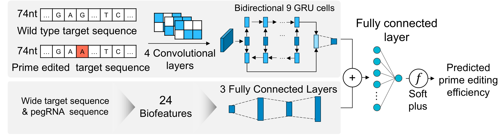

<div align="center">
  
  

**Genome Editing Toolkit** </br>
**Since 2022. 08. 19.** </br>

[](https://badge.fury.io/py/genet) 
[](https://badge.fury.io/py/genet) 
[](https://genethq.slack.com/archives/C04DP727E4E)
[](https://goosang-yu.github.io/genet/getting_started/)
[](https://img.shields.io/pypi/l/ansicolortags.svg) 


<div align="left">

## Welcome to GenET
GenET (Genome Editing Toolkit) is a library of various python functions for the purpose of analyzing and evaluating data from genome editing experiments. GenET is still in its early stages of development and continue to improve and expand. Currently planned functions include guideRNA design, saturation library design, deep sequenced data analysis, and guide RNA activity prediction.

Please see the [documentation](https://goosang-yu.github.io/genet/).


## Installation
#### 1/ Create virtual environment and install genet
```python
# Create virtual env for genet. (python 3.8 was tested)
conda create -n genet python=3.8
conda activate genet

# Install genet ( >= ver. 0.7.0)
pip install genet
```

#### 2/ Install Pytorch (v1.11.0 was tested)  
Pytorch ver.2 is not compatible yet.
```python
# For OSX (MacOS)
pip install torch==1.11.0

# For Linux and Windows
# CUDA 11.3 (choose version degending on your GPU)
pip install torch==1.11.0+cu113 --extra-index-url https://download.pytorch.org/whl/cu113

# CPU only
pip install torch==1.11.0+cpu --extra-index-url https://download.pytorch.org/whl/cpu
```
#### 3/ Install ViennaRNA
```python
# install ViennaRNA package for prediction module
conda install viennarna
```

## Who should use GenET?
GenET was developed for anyone interested in the field of genome editing. Especially, Genet can provide aid to those with the following objectives.: <br />

- Develop a quick and easy to design an genome editing experiment for a specific gene.
- Perform genome editing analysis based on sequening data
- Predict the activtiy of specific guideRNAs or all guideRNAs designed for editing a specific product.


## Example: Prediction of prime editing efficiency by DeepPrime

DeepPrime is a prediction model for evaluating prime editing guideRNAs (pegRNAs) that target specific target sites for prime editing ([Yu et al. Cell 2023](https://doi.org/10.1016/j.cell.2023.03.034)). DeepSpCas9 prediction score is calculated simultaneously and requires tensorflow (version >=2.6). DeepPrime was developed on pytorch.

```python 
from genet.predict import DeepPrime

seq_wt   = 'ATGACAATAAAAGACAACACCCTTGCCTTGTGGAGTTTTCAAAGCTCCCAGAAACTGAGAAGAACTATAACCTGCAAATGTCAACTGAAACCTTAAAGTGAGTATTTAATTGAGCTGAAGT'
seq_ed   = 'ATGACAATAAAAGACAACACCCTTGCCTTGTGGAGTTTTCAAAGCTCCCAGAAACTGAGACGAACTATAACCTGCAAATGTCAACTGAAACCTTAAAGTGAGTATTTAATTGAGCTGAAGT'

pegrna = DeepPrime('Test', seq_wt, seq_ed, edit_type='sub', edit_len=1)

# check designed pegRNAs
>>> pegrna.features
```

|   | ID   | WT74_On                                                                    | Edited74_On                                                                | PBSlen | RTlen | RT-PBSlen | Edit_pos | Edit_len | RHA_len | type_sub | type_ins | type_del | Tm1      | Tm2     | Tm2new  | Tm3       | Tm4      | TmD       | nGCcnt1 | nGCcnt2 | nGCcnt3 | fGCcont1 | fGCcont2 | fGCcont3 | MFE3   | MFE4  | DeepSpCas9_score |
| - | ---- | -------------------------------------------------------------------------- | -------------------------------------------------------------------------- | ------ | ----- | --------- | -------- | -------- | ------- | -------- | -------- | -------- | -------- | ------- | ------- | --------- | -------- | --------- | ------- | ------- | ------- | -------- | -------- | -------- | ------ | ----- | ---------------- |
| 0 | Test | ATAAAAGACAACACCCTTGCCTTGTGGAGTTTTCAAAGCTCCCAGAAACTGAGAAGAACTATAACCTGCAAATG | xxxxxxxxxxxxxxCCTTGCCTTGTGGAGTTTTCAAAGCTCCCAGAAACTGAGACGxxxxxxxxxxxxxxxxxx | 7      | 35    | 42        | 34       | 1        | 1       | 1        | 0        | 0        | 16.19097 | 62.1654 | 62.1654 | \-277.939 | 58.22525 | \-340.105 | 5       | 16      | 21      | 71.42857 | 45.71429 | 50       | \-10.4 | \-0.6 | 45.96754         |
| 1 | Test | ATAAAAGACAACACCCTTGCCTTGTGGAGTTTTCAAAGCTCCCAGAAACTGAGAAGAACTATAACCTGCAAATG | xxxxxxxxxxxxxCCCTTGCCTTGTGGAGTTTTCAAAGCTCCCAGAAACTGAGACGxxxxxxxxxxxxxxxxxx | 8      | 35    | 43        | 34       | 1        | 1       | 1        | 0        | 0        | 30.19954 | 62.1654 | 62.1654 | \-277.939 | 58.22525 | \-340.105 | 6       | 16      | 22      | 75       | 45.71429 | 51.16279 | \-10.4 | \-0.6 | 45.96754         |
| 2 | Test | ATAAAAGACAACACCCTTGCCTTGTGGAGTTTTCAAAGCTCCCAGAAACTGAGAAGAACTATAACCTGCAAATG | xxxxxxxxxxxxACCCTTGCCTTGTGGAGTTTTCAAAGCTCCCAGAAACTGAGACGxxxxxxxxxxxxxxxxxx | 9      | 35    | 44        | 34       | 1        | 1       | 1        | 0        | 0        | 33.78395 | 62.1654 | 62.1654 | \-277.939 | 58.22525 | \-340.105 | 6       | 16      | 22      | 66.66667 | 45.71429 | 50       | \-10.4 | \-0.6 | 45.96754         |
| 3 | Test | ATAAAAGACAACACCCTTGCCTTGTGGAGTTTTCAAAGCTCCCAGAAACTGAGAAGAACTATAACCTGCAAATG | xxxxxxxxxxxCACCCTTGCCTTGTGGAGTTTTCAAAGCTCCCAGAAACTGAGACGxxxxxxxxxxxxxxxxxx | 10     | 35    | 45        | 34       | 1        | 1       | 1        | 0        | 0        | 38.51415 | 62.1654 | 62.1654 | \-277.939 | 58.22525 | \-340.105 | 7       | 16      | 23      | 70       | 45.71429 | 51.11111 | \-10.4 | \-0.6 | 45.96754         |
| 4 | Test | ATAAAAGACAACACCCTTGCCTTGTGGAGTTTTCAAAGCTCCCAGAAACTGAGAAGAACTATAACCTGCAAATG | xxxxxxxxxxACACCCTTGCCTTGTGGAGTTTTCAAAGCTCCCAGAAACTGAGACGxxxxxxxxxxxxxxxxxx | 11     | 35    | 46        | 34       | 1        | 1       | 1        | 0        | 0        | 40.87411 | 62.1654 | 62.1654 | \-277.939 | 58.22525 | \-340.105 | 7       | 16      | 23      | 63.63636 | 45.71429 | 50       | \-10.4 | \-0.6 | 45.96754         |
| 5 | Test | ATAAAAGACAACACCCTTGCCTTGTGGAGTTTTCAAAGCTCCCAGAAACTGAGAAGAACTATAACCTGCAAATG | xxxxxxxxxAACACCCTTGCCTTGTGGAGTTTTCAAAGCTCCCAGAAACTGAGACGxxxxxxxxxxxxxxxxxx | 12     | 35    | 47        | 34       | 1        | 1       | 1        | 0        | 0        | 40.07098 | 62.1654 | 62.1654 | \-277.939 | 58.22525 | \-340.105 | 7       | 16      | 23      | 58.33333 | 45.71429 | 48.93617 | \-10.4 | \-0.6 | 45.96754         |

Next, select model PE system and run DeepPrime
```python 
pe2max_output = pegrna.predict(pe_system='PE2max', cell_type='HEK293T')

>>> pe2max_output.head()
```
|   | Target                                            | Spacer                         | RT-PBS                                         | PBSlen | RTlen | RT-PBSlen | Edit_pos | Edit_len | RHA_len | PE2max_score |
| - | ------------------------------------------------- | ------------------------------ | ---------------------------------------------- | ------ | ----- | --------- | -------- | -------- | ------- | ------------ |
| 0 | ATAAAAGACAACACCCTTGCCTTGTGGAGTTTTCAAAGCTCCCAGA... | ATAAAAGACAACACCCTTGCCTTGTGGAGT | CGTCTCAGTTTCTGGGAGCTTTGAAAACTCCACAAGGCAAGG     | 7      | 35    | 42        | 34       | 1        | 1       | 0.904907     |
| 1 | ATAAAAGACAACACCCTTGCCTTGTGGAGTTTTCAAAGCTCCCAGA... | ATAAAAGACAACACCCTTGCCTTGTGGAGT | CGTCTCAGTTTCTGGGAGCTTTGAAAACTCCACAAGGCAAGGG    | 8      | 35    | 43        | 34       | 1        | 1       | 2.377118     |
| 2 | ATAAAAGACAACACCCTTGCCTTGTGGAGTTTTCAAAGCTCCCAGA... | ATAAAAGACAACACCCTTGCCTTGTGGAGT | CGTCTCAGTTTCTGGGAGCTTTGAAAACTCCACAAGGCAAGGGT   | 9      | 35    | 44        | 34       | 1        | 1       | 2.613841     |
| 3 | ATAAAAGACAACACCCTTGCCTTGTGGAGTTTTCAAAGCTCCCAGA... | ATAAAAGACAACACCCTTGCCTTGTGGAGT | CGTCTCAGTTTCTGGGAGCTTTGAAAACTCCACAAGGCAAGGGTG  | 10     | 35    | 45        | 34       | 1        | 1       | 3.643573     |
| 4 | ATAAAAGACAACACCCTTGCCTTGTGGAGTTTTCAAAGCTCCCAGA... | ATAAAAGACAACACCCTTGCCTTGTGGAGT | CGTCTCAGTTTCTGGGAGCTTTGAAAACTCCACAAGGCAAGGGTGT | 11     | 35    | 46        | 34       | 1        | 1       | 3.770234     |


The previous function, ```pe_score()```, is still available for use. However, please note that this function will be deprecated in the near future.
```python
from genet import predict as prd

# Place WT sequence and Edited sequence information, respectively.
# And select the edit type you want to make and put it in.
#Input seq: 60bp 5' context + 1bp center + 60bp 3' context (total 121bp)

seq_wt   = 'ATGACAATAAAAGACAACACCCTTGCCTTGTGGAGTTTTCAAAGCTCCCAGAAACTGAGAAGAACTATAACCTGCAAATGTCAACTGAAACCTTAAAGTGAGTATTTAATTGAGCTGAAGT'
seq_ed   = 'ATGACAATAAAAGACAACACCCTTGCCTTGTGGAGTTTTCAAAGCTCCCAGAAACTGAGACGAACTATAACCTGCAAATGTCAACTGAAACCTTAAAGTGAGTATTTAATTGAGCTGAAGT'
alt_type = 'sub1'

df_pe = prd.pe_score(seq_wt, seq_ed, alt_type)
df_pe.head()
```
|   | Target                                            | Spacer                         | RT-PBS                                         | PBSlen | RTlen | RT-PBSlen | Edit_pos | Edit_len | RHA_len | PE2max_score |
| - | ------------------------------------------------- | ------------------------------ | ---------------------------------------------- | ------ | ----- | --------- | -------- | -------- | ------- | ------------ |
| 0 | ATAAAAGACAACACCCTTGCCTTGTGGAGTTTTCAAAGCTCCCAGA... | ATAAAAGACAACACCCTTGCCTTGTGGAGT | CGTCTCAGTTTCTGGGAGCTTTGAAAACTCCACAAGGCAAGG     | 7      | 35    | 42        | 34       | 1        | 1       | 0.904907     |
| 1 | ATAAAAGACAACACCCTTGCCTTGTGGAGTTTTCAAAGCTCCCAGA... | ATAAAAGACAACACCCTTGCCTTGTGGAGT | CGTCTCAGTTTCTGGGAGCTTTGAAAACTCCACAAGGCAAGGG    | 8      | 35    | 43        | 34       | 1        | 1       | 2.377118     |
| 2 | ATAAAAGACAACACCCTTGCCTTGTGGAGTTTTCAAAGCTCCCAGA... | ATAAAAGACAACACCCTTGCCTTGTGGAGT | CGTCTCAGTTTCTGGGAGCTTTGAAAACTCCACAAGGCAAGGGT   | 9      | 35    | 44        | 34       | 1        | 1       | 2.613841     |
| 3 | ATAAAAGACAACACCCTTGCCTTGTGGAGTTTTCAAAGCTCCCAGA... | ATAAAAGACAACACCCTTGCCTTGTGGAGT | CGTCTCAGTTTCTGGGAGCTTTGAAAACTCCACAAGGCAAGGGTG  | 10     | 35    | 45        | 34       | 1        | 1       | 3.643573     |
| 4 | ATAAAAGACAACACCCTTGCCTTGTGGAGTTTTCAAAGCTCCCAGA... | ATAAAAGACAACACCCTTGCCTTGTGGAGT | CGTCTCAGTTTCTGGGAGCTTTGAAAACTCCACAAGGCAAGGGTGT | 11     | 35    | 46        | 34       | 1        | 1       | 3.770234     |

  

It is also possible to predict other cell lines (A549, DLD1...) and PE systems (PE2max, PE4max...).

```python
df_pe = prd.pe_score(seq_wt, seq_ed, alt_type, sID='MyGene', pe_system='PE4max', cell_type='A549')
```


Please send all comments and questions to gsyu93@gmail.com