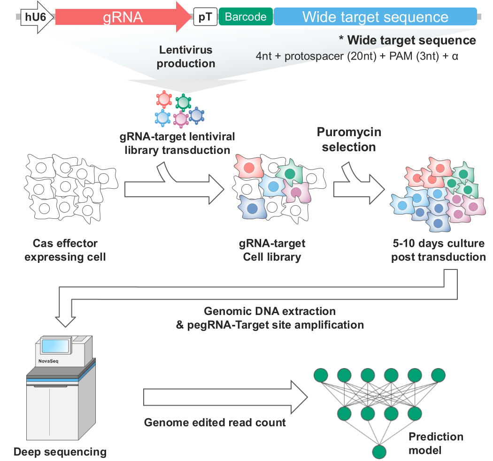
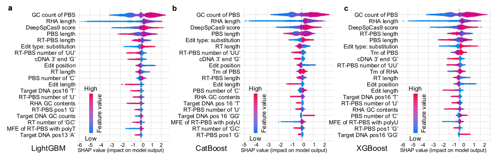
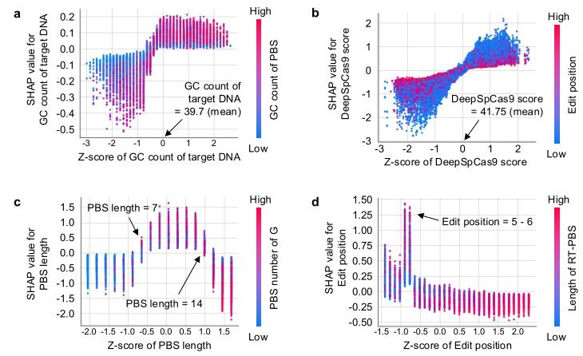

Why is gRNA design important?

The efficiency of CRISPR systems for genome editing is determined by the gRNA and its corresponding target sequence information. Specific motifs or GC contents of the sequence can have an impact.

## High-throughput screening

## Features determining genome editing efficiencies

