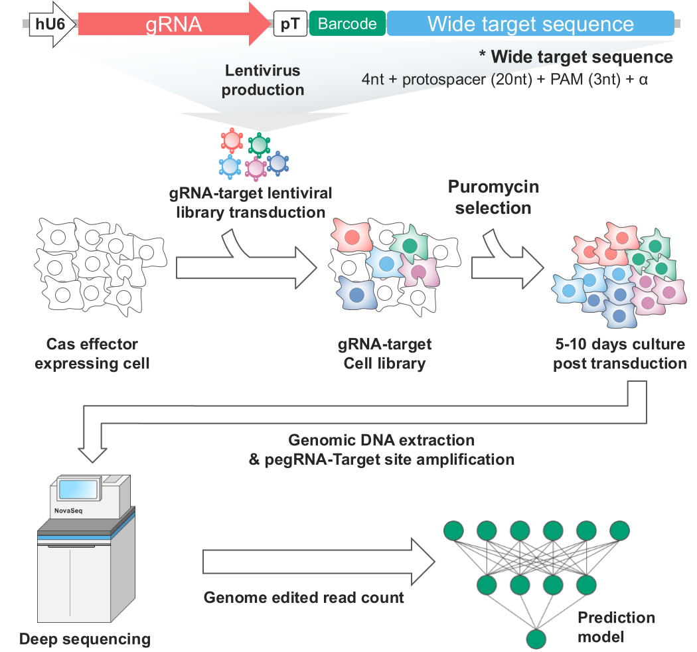
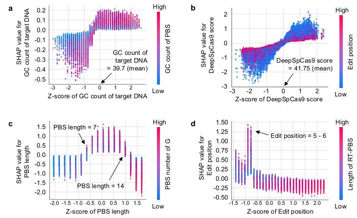
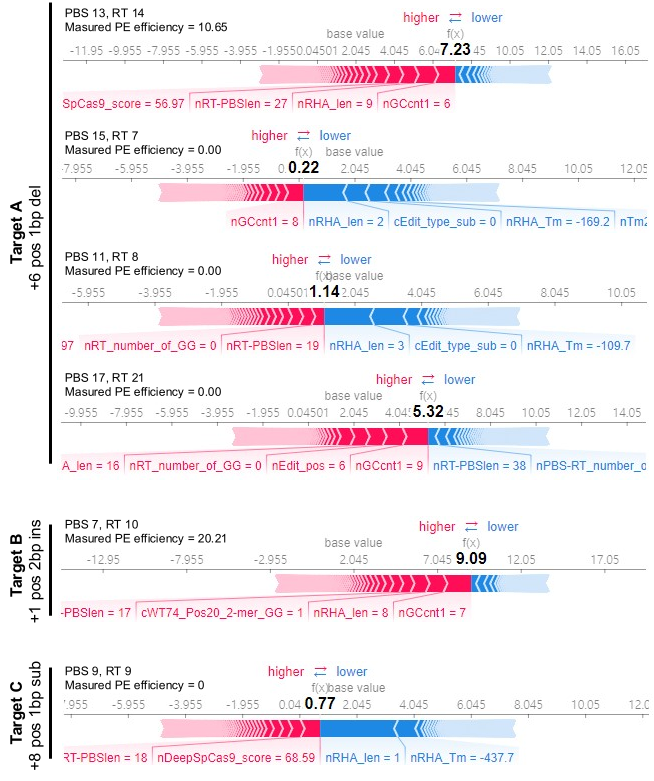

## 왜 gRNA 디자인이 중요할까?

CRISPR system들은 gRNA와 그에 대응하는 target 서열 정보에 따라 genome editing 효율이 결정된다. 서열의 특정 motif 또는 GC contents 등이 영향을 미칠 수 있다. 

## High-throughput screening

## Features determining genome editing efficiencies

