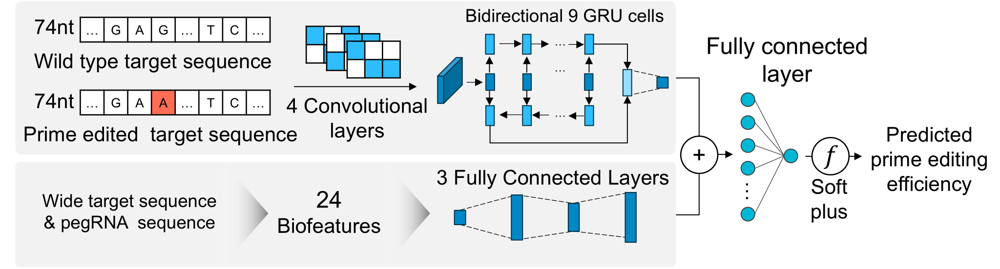

### Predict Prime editing efficiency

DeepPrime is a prediction model for evaluating prime editing guideRNAs (pegRNAs) that target specific target sites for prime editing ([Yu et al. Cell 2023](https://doi.org/10.1016/j.cell.2023.03.034)). DeepSpCas9 prediction score is calculated simultaneously and requires tensorflow (version >=2.6). DeepPrime was developed on pytorch.

```python 
from genet.predict import DeepPrime

seq_wt   = 'ATGACAATAAAAGACAACACCCTTGCCTTGTGGAGTTTTCAAAGCTCCCAGAAACTGAGAAGAACTATAACCTGCAAATGTCAACTGAAACCTTAAAGTGAGTATTTAATTGAGCTGAAGT'
seq_ed   = 'ATGACAATAAAAGACAACACCCTTGCCTTGTGGAGTTTTCAAAGCTCCCAGAAACTGAGACGAACTATAACCTGCAAATGTCAACTGAAACCTTAAAGTGAGTATTTAATTGAGCTGAAGT'

pegrna = DeepPrime('Test', seq_wt, seq_ed, edit_type='sub', edit_len=1)

# check designed pegRNAs
>>> pegrna.features
```

|   | ID   | WT74_On                                                                    | Edited74_On                                                                | PBSlen | RTlen | RT-PBSlen | Edit_pos | Edit_len | RHA_len | type_sub | type_ins | type_del | Tm1      | Tm2     | Tm2new  | Tm3       | Tm4      | TmD       | nGCcnt1 | nGCcnt2 | nGCcnt3 | fGCcont1 | fGCcont2 | fGCcont3 | MFE3   | MFE4  | DeepSpCas9_score |
| - | ---- | -------------------------------------------------------------------------- | -------------------------------------------------------------------------- | ------ | ----- | --------- | -------- | -------- | ------- | -------- | -------- | -------- | -------- | ------- | ------- | --------- | -------- | --------- | ------- | ------- | ------- | -------- | -------- | -------- | ------ | ----- | ---------------- |
| 0 | Test | ATAAAAGACAACACCCTTGCCTTGTGGAGTTTTCAAAGCTCCCAGAAACTGAGAAGAACTATAACCTGCAAATG | xxxxxxxxxxxxxxCCTTGCCTTGTGGAGTTTTCAAAGCTCCCAGAAACTGAGACGxxxxxxxxxxxxxxxxxx | 7      | 35    | 42        | 34       | 1        | 1       | 1        | 0        | 0        | 16.19097 | 62.1654 | 62.1654 | \-277.939 | 58.22525 | \-340.105 | 5       | 16      | 21      | 71.42857 | 45.71429 | 50       | \-10.4 | \-0.6 | 45.96754         |
| 1 | Test | ATAAAAGACAACACCCTTGCCTTGTGGAGTTTTCAAAGCTCCCAGAAACTGAGAAGAACTATAACCTGCAAATG | xxxxxxxxxxxxxCCCTTGCCTTGTGGAGTTTTCAAAGCTCCCAGAAACTGAGACGxxxxxxxxxxxxxxxxxx | 8      | 35    | 43        | 34       | 1        | 1       | 1        | 0        | 0        | 30.19954 | 62.1654 | 62.1654 | \-277.939 | 58.22525 | \-340.105 | 6       | 16      | 22      | 75       | 45.71429 | 51.16279 | \-10.4 | \-0.6 | 45.96754         |
| 2 | Test | ATAAAAGACAACACCCTTGCCTTGTGGAGTTTTCAAAGCTCCCAGAAACTGAGAAGAACTATAACCTGCAAATG | xxxxxxxxxxxxACCCTTGCCTTGTGGAGTTTTCAAAGCTCCCAGAAACTGAGACGxxxxxxxxxxxxxxxxxx | 9      | 35    | 44        | 34       | 1        | 1       | 1        | 0        | 0        | 33.78395 | 62.1654 | 62.1654 | \-277.939 | 58.22525 | \-340.105 | 6       | 16      | 22      | 66.66667 | 45.71429 | 50       | \-10.4 | \-0.6 | 45.96754         |
| 3 | Test | ATAAAAGACAACACCCTTGCCTTGTGGAGTTTTCAAAGCTCCCAGAAACTGAGAAGAACTATAACCTGCAAATG | xxxxxxxxxxxCACCCTTGCCTTGTGGAGTTTTCAAAGCTCCCAGAAACTGAGACGxxxxxxxxxxxxxxxxxx | 10     | 35    | 45        | 34       | 1        | 1       | 1        | 0        | 0        | 38.51415 | 62.1654 | 62.1654 | \-277.939 | 58.22525 | \-340.105 | 7       | 16      | 23      | 70       | 45.71429 | 51.11111 | \-10.4 | \-0.6 | 45.96754         |
| 4 | Test | ATAAAAGACAACACCCTTGCCTTGTGGAGTTTTCAAAGCTCCCAGAAACTGAGAAGAACTATAACCTGCAAATG | xxxxxxxxxxACACCCTTGCCTTGTGGAGTTTTCAAAGCTCCCAGAAACTGAGACGxxxxxxxxxxxxxxxxxx | 11     | 35    | 46        | 34       | 1        | 1       | 1        | 0        | 0        | 40.87411 | 62.1654 | 62.1654 | \-277.939 | 58.22525 | \-340.105 | 7       | 16      | 23      | 63.63636 | 45.71429 | 50       | \-10.4 | \-0.6 | 45.96754         |
| 5 | Test | ATAAAAGACAACACCCTTGCCTTGTGGAGTTTTCAAAGCTCCCAGAAACTGAGAAGAACTATAACCTGCAAATG | xxxxxxxxxAACACCCTTGCCTTGTGGAGTTTTCAAAGCTCCCAGAAACTGAGACGxxxxxxxxxxxxxxxxxx | 12     | 35    | 47        | 34       | 1        | 1       | 1        | 0        | 0        | 40.07098 | 62.1654 | 62.1654 | \-277.939 | 58.22525 | \-340.105 | 7       | 16      | 23      | 58.33333 | 45.71429 | 48.93617 | \-10.4 | \-0.6 | 45.96754         |

Next, select model PE system and run DeepPrime
```python 
pe2max_output = pegrna.predict(pe_system='PE2max', cell_type='HEK293T')

>>> pe2max_output.head()
```

|   | Target                                            | Spacer                         | RT-PBS                                         | PBSlen | RTlen | RT-PBSlen | Edit_pos | Edit_len | RHA_len | PE2max_score |
| - | ------------------------------------------------- | ------------------------------ | ---------------------------------------------- | ------ | ----- | --------- | -------- | -------- | ------- | ------------ |
| 0 | ATAAAAGACAACACCCTTGCCTTGTGGAGTTTTCAAAGCTCCCAGA... | ATAAAAGACAACACCCTTGCCTTGTGGAGT | CGTCTCAGTTTCTGGGAGCTTTGAAAACTCCACAAGGCAAGG     | 7      | 35    | 42        | 34       | 1        | 1       | 0.904907     |
| 1 | ATAAAAGACAACACCCTTGCCTTGTGGAGTTTTCAAAGCTCCCAGA... | ATAAAAGACAACACCCTTGCCTTGTGGAGT | CGTCTCAGTTTCTGGGAGCTTTGAAAACTCCACAAGGCAAGGG    | 8      | 35    | 43        | 34       | 1        | 1       | 2.377118     |
| 2 | ATAAAAGACAACACCCTTGCCTTGTGGAGTTTTCAAAGCTCCCAGA... | ATAAAAGACAACACCCTTGCCTTGTGGAGT | CGTCTCAGTTTCTGGGAGCTTTGAAAACTCCACAAGGCAAGGGT   | 9      | 35    | 44        | 34       | 1        | 1       | 2.613841     |
| 3 | ATAAAAGACAACACCCTTGCCTTGTGGAGTTTTCAAAGCTCCCAGA... | ATAAAAGACAACACCCTTGCCTTGTGGAGT | CGTCTCAGTTTCTGGGAGCTTTGAAAACTCCACAAGGCAAGGGTG  | 10     | 35    | 45        | 34       | 1        | 1       | 3.643573     |
| 4 | ATAAAAGACAACACCCTTGCCTTGTGGAGTTTTCAAAGCTCCCAGA... | ATAAAAGACAACACCCTTGCCTTGTGGAGT | CGTCTCAGTTTCTGGGAGCTTTGAAAACTCCACAAGGCAAGGGTGT | 11     | 35    | 46        | 34       | 1        | 1       | 3.770234     |


### Get ClinVar record and DeepPrime score using GenET
ClinVar database contains mutations that are clinically evaluated to be pathogenic and related to human diseases([Laudrum et al. NAR 2018](https://academic.oup.com/nar/article/46/D1/D1062/4641904)). GenET utilized the NCBI efect module to access ClinVar records to retrieve related variant data such as the genomic sequence, position, and mutation pattern. Using this data, genET designs and evaluates pegRNAs that target the variant using DeepPrime.

```python
from genet import database as db

# Accession (VCV) or variantion ID is available
cv_record = db.GetClinVar('VCV000428864.3')

print(cv_record.seq()) # default context length = 60nt

>>> output: # WT sequence, Alt sequence
('GGTCACTCACCTGGAGTGAGCCCTGCTCCCCCCTGGCTCCTTCCCAGCCTGGGCATCCTTGAGTTCCAAGGCCTCATTCAGCTCTCGGAACATCTCGAAGCGCTCACGCCCACGGATCTGC',
 'GGTCACTCACCTGGAGTGAGCCCTGCTCCCCCCTGGCTCCTTCCCAGCCTGGGCATCCTTGTTCCAAGGCCTCATTCAGCTCTCGGAACATCTCGAAGCGCTCACGCCCACGGATCTGCAG')
```

In addition, various information other than the sequence can be obtained from the record.

```python
# for example, variant length of the record
print(cv_record.alt_len)

>>> output:
2
```

Clinvar records obtained through this process is used to design all possible pegRNAs within the genet.predict module's pecv_score function.

```python
from genet import database as db
from genet import predict as prd

cv_record = db.GetClinVar('VCV000428864.3')
prd.pecv_score(cv_record)
```