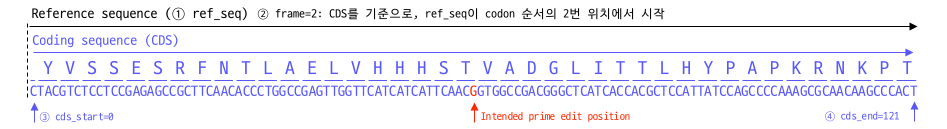

## Introduce Synonymous Mutation in pegRNA

### Additioal edit for efficient prime editing
---
Prime editing efficiency is determined by various factors beyond RT-PBS. One well-known factor is the inhibitory effect by the mismatch repair (MMR) system. To prevent prime editing efficiency inhibition by MMR, a strategy of introducing additional mutations into pegRNA can be used ([Chen et al., 2021, Cell](https://doi.org/10.1016/j.cell.2021.09.018)). 

However, introducing additional mutations may not only reduce the impact of MMR but also decrease the activity of pegRNA. Moreover, if the target site for genome editing lies within the protein coding sequence (CDS) region, it is necessary to introduce synonymous (silent) mutations that do not affect protein function. Considering these factors, designing and selecting which mutations to introduce additionally into pegRNA can be a rather cumbersome task.


### `SynonymousPE` module in GenET
---
GenET's SynonymousPE provides the functionality to easily design pegRNAs with additional mutations introduced. Specifically, it identifies possible synonymous mutations that align with the CDS, making it useful for biological research applications.

Furthermore, SynonymousPE is directly compatible with DeepPrime, allowing for the creation of pegRNAs with synonymous mutations directly from pegRNAs designed in DeepPrime. 

```python
from genet.predict import DeepPrime
from genet.design import SynonymousPE

# DeepPrime pipeline
seq_wt   = 'CTTGCCTGTCTCTGTGGGCTGAAGGCTGTTCCCTGTTTCCTTCAGCTCTACGTCTCCTCCGAGAGCCGCTTCAACACCCTGGCCGAGTTGGTTCATCATCATTCAACGGTGGCCGACGGGC'
seq_ed   = 'CTTGCCTGTCTCTGTGGGCTGAAGGCTGTTCCCTGTTTCCTTCAGCTCTACGTCTCCTCCAAGAGCCGCTTCAACACCCTGGCCGAGTTGGTTCATCATCATTCAACGGTGGCCGACGGGC'

pegrna = DeepPrime('ABL1_ex4_pos21G_A', seq_wt, seq_ed, edit_type='sub', edit_len=1)

pe2max_output = pegrna.predict(pe_system='PE2max', cell_type='HEK293T')


# Select a pegRNA record that you want to add synonymous mutation 
dp_record = pe2max_output.iloc[9]

# Setup SynonymousPE input parameters 
synony_pegrna = SynonymousPE(dp_record, ref_seq=seq_wt,
                            frame=0, cds_start=45, cds_end=121)

# print selected RTT containing synonymous mutation
print(synony_pegrna.extension)
```


You can find more detailed information about the usage of DeepPrime in the documentation of the genet.predict module [documentation](/docs/en/1_Predict/predict_pe.md). In the provided example, a synonymous mutation was introduced into one of the many designed pegRNAs. Since each pegRNA may have different regions and lengths for RTT, the types of additional mutations that can be introduced may also vary.

It is recommended to first select appropriate pegRNAs based on DeepPrime scores and then further optimize them using SynonymousPE.

### SynonymousPE's input parameters
---
`de_record`: pd.Series  
An object containing information about the pegRNA. When designed using DeepPrime, if you retrieve a specific index from the resulting DataFrame, you can use it directly.

`ref_seq`: str  
The DNA sequence information that serves as the target for the pegRNA. SynonymousPE assumes the presence of a CDS within this sequence and introduces synonymous mutations according to predefined rules. The genetic sequence used as the reference for frame, cds_start, and cds_end is defined below.  

`frame`: int  
This value represents the frame of the reference sequence (ref_seq). It is determined by the codon frame of the CDS and is expressed as 0, 1, or 2. For example, if the CDS sequence starts from the beginning of a codon (3bp), you would input frame as 0. It's crucial to input the correct frame, as an inaccurate frame could lead to synonymous mutations resulting in a completely different amino acid sequence.


`cds_start`: int  
`ref_seq` Indicates the position where the CDS starts in the ref_seq.

`cds_end`: int  
`ref_seq` Indicates the position where the CDS ends in the ref_seq.

`adj_rha`: bool  
When a synonymous mutation occurs in the RHA of the RT template, the efficiency of prime editing may significantly decrease if the RHA becomes too short. As an alternative, you can artificially extend the length of the RT template. adj_rha is an option to specify whether to extend the length of the RT template by the same amount as the shortening of the RHA when it becomes too short (default: True). If adj_rha is set to False, regardless of where the synonymous mutation occurs, the length of the RT template remains the same as that of the original pegRNA.

### `SynonymousPE` input examples
---
The information regarding the frame and CDS positioning in SynonymousPE can be somewhat complex to grasp at first use. 

#### Example 1:
---


```python
from genet.design import SynonymousPE

# pegRNA record & ref_seq
dp_record = dp_record
ref_seq   = 'CTCTACGTCTCCTCCGAGAGCCGCTTCAACACCCTGGCCGAGTTGGTTCATCATCATTCAACGGTGGCCGACGGGCTCATCACCACGCTCCATTATCCAGCCCCAAAGCGCAACAAGCCCA'

# Setup SynonymousPE 
synony_pegrna = SynonymousPE(dp_record, ref_seq=ref_seq, frame=0, cds_start=0, cds_end=121)
```

#### Example 2:
---


```python
from genet.design import SynonymousPE

# pegRNA record & ref_seq
dp_record = dp_record
ref_seq   = 'CTACGTCTCCTCCGAGAGCCGCTTCAACACCCTGGCCGAGTTGGTTCATCATCATTCAACGGTGGCCGACGGGCTCATCACCACGCTCCATTATCCAGCCCCAAAGCGCAACAAGCCCACT'

# Setup SynonymousPE 
synony_pegrna = SynonymousPE(dp_record, ref_seq=ref_seq, frame=2, cds_start=0, cds_end=121)
```

#### Example 3:
---


```python
from genet.design import SynonymousPE

# pegRNA record & ref_seq
dp_record = dp_record
ref_seq   = 'TTGCCTGTCTCTGTGGGCTGAAGGCTGTTCCCTGTTTCCTTCAGCTCTACGTCTCCTCCGAGAGCCGCTTCAACACCCTGGCCGAGTTGGTTCATCATCATTCAACGGTGGCCGACGGGCT'

# Setup SynonymousPE 
synony_pegrna = SynonymousPE(dp_record, ref_seq=ref_seq, frame=1, cds_start=44, cds_end=121)
```


### `SynonymousPE`s mutation Priority
---
When introducing a 1bp point mutation into the pegRNA RT template, there may be multiple synonymous mutations. <code>SynonymousPE</code> assigns priority scores to each possible mutation and selects the RT template with the highest priority mutation for additional incorporation, providing it as <code>.extension</code>. The criteria for determining the priority of <code>SynonymousPE</code> are as follows.

- Priority 1: If there is a synonymous mutation that eliminates the PAM (GG), it is assigned the highest priority.
- Priority 2: When introduced into the Left Homology Arm (LHA), mutations closer to the intended prime-edit position are assigned higher priority.
- Priority 3: When introduced into the Right Homology Arm (RHA), mutations closer to the intended prime-edit position are assigned higher priority.

### `stack`: Introduction of synonymous mutations
---
This functionality allows for the insertion of multiple synonymous mutations into a single RT template. By default, <code>SynonymousPE</code> selects the highest priority mutation among those introducing only one synonymous mutation into the RT template and provides it as <code>.extension</code>. However, if you wish to introduce two or more synonymous mutations simultaneously, you can use the <code>.stack</code> method.

```python 
from genet.design import SynonymousPE

# Create a SynonymousPE object
synony_pegrna = design.SynonymousPE(dp_record, ref_seq=seq_wt, frame=0)

# Generate an RT template with up to three synonymous mutations introduced
three_syn = synony_pegrna.stack(num=3)
```

`.stack`
It incorporates possible synonymous mutations in order of assigned priority. When each synonymous mutation is introduced individually, there is no change in the amino acid sequence. However, when two mutations are introduced simultaneously, there may be a change in the amino acid sequence. In such cases, the process moves on to the next priority mutation.

### Objects Available for Retrieval in SynonymousPE
---
Below are the objects available for accessing key results.

| Name          | Type         | Description                                                                                  |
| ------------- | ------------ | -------------------------------------------------------------------------------------------- |
| `.extension`  | str          | Selected RT-PBS sequence containing recommanded synonymous mutation.                         |
| `.synonymous` | pd.DataFrame | Table of available synonymous mutations and corresponding informations for given pegRNA.     |
| `.mutations`  | pd.DataFrame | Table of all available additional mutations and corresponding informations for given pegRNA. |
| `.rec`        | pd.Series    | Record of pegRNA from input.                                                                 |

다음과 같이 값을 확인할 수 있다. 

```python 
from genet.design import SynonymousPE

# Create a SynonymousPE object
synony_pegrna = design.SynonymousPE(dp_record, ref_seq=seq_wt, frame=0)

# Check for available synonymous mutations for introduction
synony_pegrna.synonymous
```

Results:

| Codon_WT                                | Codon_Mut                               | Codon_MutPos | Codon_RefStart | Codon_RefEnd | RTT_DNA_frame | RTT_DNA_Strand | AminoAcid_WT | AminoAcid_Mut | Silent_check | Mut_pos | Mut_refpos | PAM_Mut | Priority | Edit_class | RTT_DNA_Mut                            |
| --------------------------------------- | --------------------------------------- | ------------ | -------------- | ------------ | ------------- | -------------- | ------------ | ------------- | ------------ | ------- | ---------- | ------- | -------- | ---------- | -------------------------------------- |
| GCCGTGGAGGAGCCGCAGTCAGATCCTAGCGTCGAGCCC | GCCGTCGAGGAGCCGCAGTCAGATCCTAGCGTCGAGCCC | 5            | 58             | 97           | 1             | +              | VEEPQSDPSVEP | VEEPQSDPSVEP  | TRUE         | 5       | 62         | CG      | 1        | PAM_edit   | CCGTCGAGGAGCCGCAGTCAGATCCTAGCGTCGAGCCC |
| GCCGTGGAGGAGCCGCAGTCAGATCCTAGCGTCGAGCCC | GCCGTAGAGGAGCCGCAGTCAGATCCTAGCGTCGAGCCC | 5            | 58             | 97           | 1             | +              | VEEPQSDPSVEP | VEEPQSDPSVEP  | TRUE         | 5       | 62         | AG      | 2        | PAM_edit   | CCGTAGAGGAGCCGCAGTCAGATCCTAGCGTCGAGCCC |
| GCCGTGGAGGAGCCGCAGTCAGATCCTAGCGTCGAGCCC | GCCGTTGAGGAGCCGCAGTCAGATCCTAGCGTCGAGCCC | 5            | 58             | 97           | 1             | +              | VEEPQSDPSVEP | VEEPQSDPSVEP  | TRUE         | 5       | 62         | TG      | 2        | PAM_edit   | CCGTTGAGGAGCCGCAGTCAGATCCTAGCGTCGAGCCC |
| GCCGTGGAGGAGCCGCAGTCAGATCCTAGCGTCGAGCCC | GCCGTGGAAGAGCCGCAGTCAGATCCTAGCGTCGAGCCC | 8            | 58             | 97           | 1             | +              | VEEPQSDPSVEP | VEEPQSDPSVEP  | TRUE         | 8       | 65         | GG      | 15       | RHA_edit   | CCGTGGAAGAGCCGCAGTCAGATCCTAGCGTCGAGCCC |
| GCCGTGGAGGAGCCGCAGTCAGATCCTAGCGTCGAGCCC | GCCGTGGAGGAACCGCAGTCAGATCCTAGCGTCGAGCCC | 11           | 58             | 97           | 1             | +              | VEEPQSDPSVEP | VEEPQSDPSVEP  | TRUE         | 11      | 68         | GG      | 18       | RHA_edit   | CCGTGGAGGAACCGCAGTCAGATCCTAGCGTCGAGCCC |
| GCCGTGGAGGAGCCGCAGTCAGATCCTAGCGTCGAGCCC | GCCGTGGAGGAGCCCCAGTCAGATCCTAGCGTCGAGCCC | 14           | 58             | 97           | 1             | +              | VEEPQSDPSVEP | VEEPQSDPSVEP  | TRUE         | 14      | 71         | GG      | 20       | RHA_edit   | CCGTGGAGGAGCCCCAGTCAGATCCTAGCGTCGAGCCC |
| GCCGTGGAGGAGCCGCAGTCAGATCCTAGCGTCGAGCCC | GCCGTGGAGGAGCCACAGTCAGATCCTAGCGTCGAGCCC | 14           | 58             | 97           | 1             | +              | VEEPQSDPSVEP | VEEPQSDPSVEP  | TRUE         | 14      | 71         | GG      | 21       | RHA_edit   | CCGTGGAGGAGCCACAGTCAGATCCTAGCGTCGAGCCC |
| GCCGTGGAGGAGCCGCAGTCAGATCCTAGCGTCGAGCCC | GCCGTGGAGGAGCCTCAGTCAGATCCTAGCGTCGAGCCC | 14           | 58             | 97           | 1             | +              | VEEPQSDPSVEP | VEEPQSDPSVEP  | TRUE         | 14      | 71         | GG      | 21       | RHA_edit   | CCGTGGAGGAGCCTCAGTCAGATCCTAGCGTCGAGCCC |
| GCCGTGGAGGAGCCGCAGTCAGATCCTAGCGTCGAGCCC | GCCGTGGAGGAGCCGCAATCAGATCCTAGCGTCGAGCCC | 17           | 58             | 97           | 1             | +              | VEEPQSDPSVEP | VEEPQSDPSVEP  | TRUE         | 17      | 74         | GG      | 24       | RHA_edit   | CCGTGGAGGAGCCGCAATCAGATCCTAGCGTCGAGCCC |
| GCCGTGGAGGAGCCGCAGTCAGATCCTAGCGTCGAGCCC | GCCGTGGAGGAGCCGCAGTCTGATCCTAGCGTCGAGCCC | 20           | 58             | 97           | 1             | +              | VEEPQSDPSVEP | VEEPQSDPSVEP  | TRUE         | 20      | 77         | GG      | 26       | RHA_edit   | CCGTGGAGGAGCCGCAGTCTGATCCTAGCGTCGAGCCC |
| GCCGTGGAGGAGCCGCAGTCAGATCCTAGCGTCGAGCCC | GCCGTGGAGGAGCCGCAGTCCGATCCTAGCGTCGAGCCC | 20           | 58             | 97           | 1             | +              | VEEPQSDPSVEP | VEEPQSDPSVEP  | TRUE         | 20      | 77         | GG      | 27       | RHA_edit   | CCGTGGAGGAGCCGCAGTCCGATCCTAGCGTCGAGCCC |
| GCCGTGGAGGAGCCGCAGTCAGATCCTAGCGTCGAGCCC | GCCGTGGAGGAGCCGCAGTCGGATCCTAGCGTCGAGCCC | 20           | 58             | 97           | 1             | +              | VEEPQSDPSVEP | VEEPQSDPSVEP  | TRUE         | 20      | 77         | GG      | 27       | RHA_edit   | CCGTGGAGGAGCCGCAGTCGGATCCTAGCGTCGAGCCC |
| GCCGTGGAGGAGCCGCAGTCAGATCCTAGCGTCGAGCCC | GCCGTGGAGGAGCCGCAGTCAGACCCTAGCGTCGAGCCC | 23           | 58             | 97           | 1             | +              | VEEPQSDPSVEP | VEEPQSDPSVEP  | TRUE         | 23      | 80         | GG      | 30       | RHA_edit   | CCGTGGAGGAGCCGCAGTCAGACCCTAGCGTCGAGCCC |
| GCCGTGGAGGAGCCGCAGTCAGATCCTAGCGTCGAGCCC | GCCGTGGAGGAGCCGCAGTCAGATCCAAGCGTCGAGCCC | 26           | 58             | 97           | 1             | +              | VEEPQSDPSVEP | VEEPQSDPSVEP  | TRUE         | 26      | 83         | GG      | 32       | RHA_edit   | CCGTGGAGGAGCCGCAGTCAGATCCAAGCGTCGAGCCC |
| GCCGTGGAGGAGCCGCAGTCAGATCCTAGCGTCGAGCCC | GCCGTGGAGGAGCCGCAGTCAGATCCGAGCGTCGAGCCC | 26           | 58             | 97           | 1             | +              | VEEPQSDPSVEP | VEEPQSDPSVEP  | TRUE         | 26      | 83         | GG      | 33       | RHA_edit   | CCGTGGAGGAGCCGCAGTCAGATCCGAGCGTCGAGCCC |
| GCCGTGGAGGAGCCGCAGTCAGATCCTAGCGTCGAGCCC | GCCGTGGAGGAGCCGCAGTCAGATCCCAGCGTCGAGCCC | 26           | 58             | 97           | 1             | +              | VEEPQSDPSVEP | VEEPQSDPSVEP  | TRUE         | 26      | 83         | GG      | 33       | RHA_edit   | CCGTGGAGGAGCCGCAGTCAGATCCCAGCGTCGAGCCC |
| GCCGTGGAGGAGCCGCAGTCAGATCCTAGCGTCGAGCCC | GCCGTGGAGGAGCCGCAGTCAGATCCTAGTGTCGAGCCC | 29           | 58             | 97           | 1             | +              | VEEPQSDPSVEP | VEEPQSDPSVEP  | TRUE         | 29      | 86         | GG      | 36       | RHA_edit   | CCGTGGAGGAGCCGCAGTCAGATCCTAGTGTCGAGCCC |
| GCCGTGGAGGAGCCGCAGTCAGATCCTAGCGTCGAGCCC | GCCGTGGAGGAGCCGCAGTCAGATCCTAGCGTGGAGCCC | 32           | 58             | 97           | 1             | +              | VEEPQSDPSVEP | VEEPQSDPSVEP  | TRUE         | 32      | 89         | GG      | 38       | RHA_edit   | CCGTGGAGGAGCCGCAGTCAGATCCTAGCGTGGAGCCC |
| GCCGTGGAGGAGCCGCAGTCAGATCCTAGCGTCGAGCCC | GCCGTGGAGGAGCCGCAGTCAGATCCTAGCGTAGAGCCC | 32           | 58             | 97           | 1             | +              | VEEPQSDPSVEP | VEEPQSDPSVEP  | TRUE         | 32      | 89         | GG      | 39       | RHA_edit   | CCGTGGAGGAGCCGCAGTCAGATCCTAGCGTAGAGCCC |
| GCCGTGGAGGAGCCGCAGTCAGATCCTAGCGTCGAGCCC | GCCGTGGAGGAGCCGCAGTCAGATCCTAGCGTTGAGCCC | 32           | 58             | 97           | 1             | +              | VEEPQSDPSVEP | VEEPQSDPSVEP  | TRUE         | 32      | 89         | GG      | 39       | RHA_edit   | CCGTGGAGGAGCCGCAGTCAGATCCTAGCGTTGAGCCC |
| GCCGTGGAGGAGCCGCAGTCAGATCCTAGCGTCGAGCCC | GCCGTGGAGGAGCCGCAGTCAGATCCTAGCGTCGAACCC | 35           | 58             | 97           | 1             | +              | VEEPQSDPSVEP | VEEPQSDPSVEP  | TRUE         | 35      | 92         | GG      | 42       | RHA_edit   | CCGTGGAGGAGCCGCAGTCAGATCCTAGCGTCGAACCC |
| GCCGTGGAGGAGCCGCAGTCAGATCCTAGCGTCGAGCCC | GCCGTGGAGGAGCCGCAGTCAGATCCTAGCGTCGAGCCG | 38           | 58             | 97           | 1             | +              | VEEPQSDPSVEP | VEEPQSDPSVEP  | TRUE         | 38      | 95         | GG      | 44       | RHA_edit   | CCGTGGAGGAGCCGCAGTCAGATCCTAGCGTCGAGCCG |
| GCCGTGGAGGAGCCGCAGTCAGATCCTAGCGTCGAGCCC | GCCGTGGAGGAGCCGCAGTCAGATCCTAGCGTCGAGCCA | 38           | 58             | 97           | 1             | +              | VEEPQSDPSVEP | VEEPQSDPSVEP  | TRUE         | 38      | 95         | GG      | 45       | RHA_edit   | CCGTGGAGGAGCCGCAGTCAGATCCTAGCGTCGAGCCA |
| GCCGTGGAGGAGCCGCAGTCAGATCCTAGCGTCGAGCCC | GCCGTGGAGGAGCCGCAGTCAGATCCTAGCGTCGAGCCT | 38           | 58             | 97           | 1             | +              | VEEPQSDPSVEP | VEEPQSDPSVEP  | TRUE         | 38      | 95         | GG      | 45       | RHA_edit   | CCGTGGAGGAGCCGCAGTCAGATCCTAGCGTCGAGCCT |


Below are the objects containing parameters and other detailed information used for design within the code. 

| Name         | Type | Description                                               |
| ------------ | ---- | --------------------------------------------------------- |
| `.sID`       | str  | Sample ID from pegRNA record.                             |
| `.rtpbs_dna` | str  | Reverse complementary DNA sequence of RT-PBS.             |
| `.pbs_dna`   | str  | Reverse complementary DNA sequence of PBS.                |
| `.rtt_dna`   | str  | Reverse complementary DNA sequence of RT template         |
| `.rtt_len`   | int  | Length of RT template                                     |
| `.wt_seq`    | str  | WT target sequence (74nt)                                 |
| `.ed_seq`    | str  | Prime-edited target sequence (74nt)                       |
| `.edit_pos`  | int  | Position of intended prime editing. Start from nick site. |
| `.ref_seq`   | str  | Reference target sequence from input.                     |
| `.frame`     | int  | Frame of coding sequence (CDS) from input.                |
| `.cds_start` | int  | Start position of CDS                                     |
| `.cds_end`   | int  | End position of CDS                                       |
| `.strand`    | str  | Strand of pegRNA. It should '+' or '-'.                   |
| `.rtt_frame` | int  | Frame of RT template.                                     |
| `.codon_le`  | int  | Length of left end (LE) of codon sequence.                |
| `.codon_re`  | int  | Length of right end (RE) of codon sequence.               |
| `.codon_RTT` | str  | Codon sequence with RT template.                          |

You can check the values as follows. 

```python 
from genet.design import SynonymousPE
 
synony_pegrna = design.SynonymousPE(dp_record, ref_seq=seq_wt, frame=0)
synony_pegrna.ref_seq
```