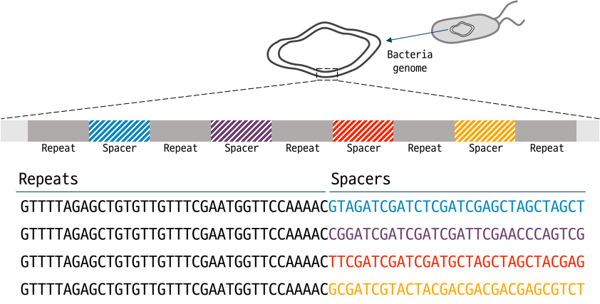

## Genome and Genetic Information
Genome refers to the entire set of genetic information of an organism. While most genomes exist in the form of DNA, some organisms, such as certain viruses, have genomes composed of RNA. The genome of eukaryotes like humans is mostly found in the DNA within the nucleus, but a small portion of the genome also exists outside the nucleus, in structures like mitochondria. These genomes consist of long combinations of nucleotides (A, T, G, C) that encode the instructions necessary for various cellular functions. In the case of humans, the genome contains approximately 3 billion base pairs of DNA sequence information.

Within the genome, specific regions contain information crucial for the expression of proteins, necessary for various life processes, and these regions are called genes. Although the terms gene and genome are sometimes used interchangeably, the genome encompasses the entire genetic information, including genes.

Genes that accurately carry protein information play a vital role in maintaining normal cellular activities. Mutations in genes can lead to the improper synthesis of essential proteins, resulting in diseases or difficulties in sustaining life. Conditions arising from damaged genetic information are referred to as genetic diseases.

## Gene Editing
In the Korean academic community, genome editing is often referred to as 'gene editing,' although the term 'genome editing' is more precise. This choice is made for ease of understanding among the general public.

Gene editing involves the technology to modify specific genetic information at desired locations within the genome. Early research on gene editing utilized techniques like Zinc Finger Nucleases (ZFN) and Transcription Activator-Like Effector Nucleases (TALEN). Currently, the CRISPR (Clustered Regularly Interspaced Short Palindromic Repeats) technology is predominantly researched.

## Mechanism of CRISPR


CRISPR is a unique sequence structure discovered by scientists specializing in the study of bacterial genes. It consists of repeated sequences with specific intervals of spacer sequences. While many gene sequences were previously unknown, the regular repetition of sequences was uncommon. This structure, found not only in specific bacterial strains but also in numerous species, was later identified as the guide RNA (gRNA) that specifies the location for the action of a gene-editing protein called Cas9.


## Various Types of CRISPR Systems
Early gene editing technologies mostly caused double-strand breaks (DSB), posing risks of unintended damage to genes. Later, base editors (BE) were developed, allowing gene editing without inducing DSB, significantly enhancing safety for correcting most single nucleotide variations (SNVs). Recently, prime editing (PE) was developed, enabling all forms of gene editing (substitution, insertion, deletion) without causing DSB, expanding the scope of gene editing.

## Utilizing GenET for Genome Editing Research
Through GenET, various functionalities are available (or planned) for research on genetic information and CRISPR. The provided (and planned) features include:

| Module   | Functions      | Descriptions                                                          | Status |
| -------- | -------------- | --------------------------------------------------------------------- | ------ |
| Predict  | SpCas9         | Use of the DeepSpCas9 model	                                        | Available   |
| Predict  | SpCas9variants | Use of the DeepSpCas9variants model                                   | Available   |
| Predict  | Base editor    | Use of the DeepBE model                                               | Planned   |
| Predict  | Prime editor   | Use of the DeepPrime model                                            | Available   |
| Design   | KOLiD          | Genome-wide KO library design                                         | Planned   |
| Design   | ReLiD          | Gene regulation library design                                        | Planned   |
| Design   | CRISPRStop     | Design gRNA for inducing premature stop codon using CBE               | Planned   |
| Design   | SynonymousPE   | Design pegRNA containing additional synonymousmutation in RT template | Available   |
| Database | GetGenome      | Function to retrieve genome data from NCBI database                   | Available   |
| Database | GetGene        | Function to retrieve information about a specific gene from NCBI database | Planned   |
| Database | GenBankParser  | Function to extract desired information from GenBank files            | Planned   |
| Database | DFConverter    | Function to convert the format of NCBI GenBank files to DataFrame     | Available   |
| Analysis | SGE            | Function for analyzing Saturation Genome Editing data                 | Planned   |
| Analysis | UMItools       | Functions for UMI analysis (from UMI-tools)                           | Available   |
| Utils    | request_file   | Function to download files from the server using the HTTP protocol    | Available   |
| Utils    | SplitFastq     | Function to split FASTQ files into smaller sizes                      | Available   |


## GenET 인용하기

```
@Manual {GenET, 
    title = {GenET: Python package for genome editing research}, 
    author = {Goosang Yu}, 
    year = {2024}, 
    month = {January}, 
    note = {GenET version 0.13.1}, 
    url = {https://github.com/Goosang-Yu/genet}
    }
```
