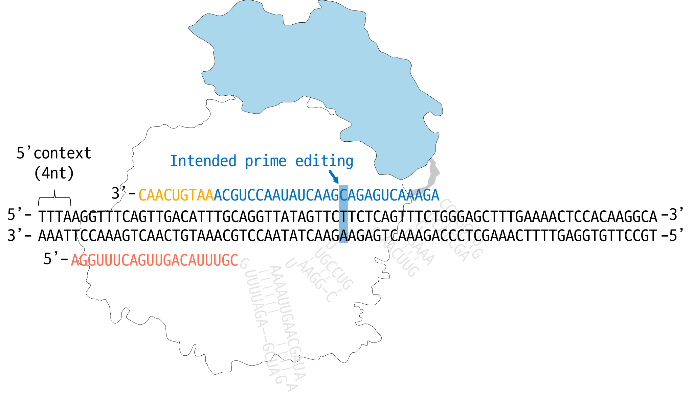

### Predict Prime editing efficiency (by DeepPrime and DeepPrime-FT)

DeepPrime is a prediction model for evaluating prime editing guideRNAs (pegRNAs) that target specific target sites for prime editing ([Yu et al. Cell 2023](https://doi.org/10.1016/j.cell.2023.03.034)). DeepSpCas9 prediction score is calculated simultaneously and requires tensorflow (version >=2.6). DeepPrime was developed on pytorch.


### How to Use DeepPrime
DeepPrime을 사용하기 위해서, intended prime editing과 주변 context 정보가 담긴 DNA sequence를 input으로 준비해야 한다. Intended prime editing은 1-3nt substitution, insertion, 또는 deletion만 가능하며, 여러 개의 edit type이 복합적으로 도입되는 것은 불가능하다. Prime editing을 도입하는 위치는 괄호로 표시되며, '/'를 이용해서 original과 prime-edited sequence를 구분한다. 

몇 가지 input 예시는 아래와 같다. 


```python
# Example 1: 1bp substitution (T to A)
input_seq = 'CTCACGTGAGCTCTTTGAGCTTGCCTGTCTCTGTGGGCTGAAGGCTGTTCCCTGTTTCCT(T/A)CAGCTCTACGTCTCCTCCGAGAGCCGCTTCAACACCCTGGCCGAGTTGGTTCATCATCAT'
```


```python
# Example 2: 3bp insertion (CTT insertion)
input_seq = 'CTCACGTGAGCTCTTTGAGCTTGCCTGTCTCTGTGGGCTGAAGGCTGTTCCCTGTTTCCT(/CTT)TCAGCTCTACGTCTCCTCCGAGAGCCGCTTCAACACCCTGGCCGAGTTGGTTCATCATCAT'
```


```python
# Example 3: 2bp deletion (TC deletion)
input_seq = 'CTCACGTGAGCTCTTTGAGCTTGCCTGTCTCTGTGGGCTGAAGGCTGTTCCCTGTTTCCT(TC/)AGCTCTACGTCTCCTCCGAGAGCCGCTTCAACACCCTGGCCGAGTTGGTTCATCATCAT'
```

If you have prepared the input as described above, you can use DeepPrime as follows. When you input the target sequence and editing informations into DeepPrime and run it, it designs all possible types of pegRNAs for the given sequence and automatically calculates their corresponding biofeatures. You can check the calculated biofeatures using `.features`.

```python 
from genet.predict import DeepPrime

input_seq = 'CTCACGTGAGCTCTTTGAGCTTGCCTGTCTCTGTGGGCTGAAGGCTGTTCCCTGTTTCCT(T/A)CAGCTCTACGTCTCCTCCGAGAGCCGCTTCAACACCCTGGCCGAGTTGGTTCATCATCAT'

pegrna = DeepPrime(input_seq)

# check designed pegRNAs
>>> pegrna.features.head()
```

|     | ID   | Spacer               | RT-PBS                                            | PBS_len | RTT_len | RT-PBS_len | Edit_pos | Edit_len | RHA_len | Target                                            | ... | deltaTm_Tm4-Tm2 | GC_count_PBS | GC_count_RTT | GC_count_RT-PBS | GC_contents_PBS | GC_contents_RTT | GC_contents_RT-PBS | MFE_RT-PBS-polyT | MFE_Spacer | DeepSpCas9_score |
| --- | ---- | -------------------- | ------------------------------------------------- | ------- | ------- | ---------- | -------- | -------- | ------- | ------------------------------------------------- | --- | --------------- | ------------ | ------------ | --------------- | --------------- | --------------- | ------------------ | ---------------- | ---------- | ---------------- |
| 0   | SampleName | AAGACAACACCCTTGCCTTG | CGTCTCAGTTTCTGGGAGCTTTGAAAACTCCACAAGGCAAGG        | 7       | 35      | 42         | 34       | 1        | 1       | ATAAAAGACAACACCCTTGCCTTGTGGAGTTTTCAAAGCTCCCAGA... | ... | \-340.105       | 5            | 16           | 21              | 71.42857        | 45.71429        | 50                 | \-10.4           | \-0.6      | 45.96754         |
| 1   | SampleName | AAGACAACACCCTTGCCTTG | CGTCTCAGTTTCTGGGAGCTTTGAAAACTCCACAAGGCAAGGG       | 8       | 35      | 43         | 34       | 1        | 1       | ATAAAAGACAACACCCTTGCCTTGTGGAGTTTTCAAAGCTCCCAGA... | ... | \-340.105       | 6            | 16           | 22              | 75              | 45.71429        | 51.16279           | \-10.4           | \-0.6      | 45.96754         |
| 2   | SampleName | AAGACAACACCCTTGCCTTG | CGTCTCAGTTTCTGGGAGCTTTGAAAACTCCACAAGGCAAGGGT      | 9       | 35      | 44         | 34       | 1        | 1       | ATAAAAGACAACACCCTTGCCTTGTGGAGTTTTCAAAGCTCCCAGA... | ... | \-340.105       | 6            | 16           | 22              | 66.66667        | 45.71429        | 50                 | \-10.4           | \-0.6      | 45.96754         |
| 3   | SampleName | AAGACAACACCCTTGCCTTG | CGTCTCAGTTTCTGGGAGCTTTGAAAACTCCACAAGGCAAGGGTG     | 10      | 35      | 45         | 34       | 1        | 1       | ATAAAAGACAACACCCTTGCCTTGTGGAGTTTTCAAAGCTCCCAGA... | ... | \-340.105       | 7            | 16           | 23              | 70              | 45.71429        | 51.11111           | \-10.4           | \-0.6      | 45.96754         |
| 4   | SampleName | AAGACAACACCCTTGCCTTG | CGTCTCAGTTTCTGGGAGCTTTGAAAACTCCACAAGGCAAGGGTGT    | 11      | 35      | 46         | 34       | 1        | 1       | ATAAAAGACAACACCCTTGCCTTGTGGAGTTTTCAAAGCTCCCAGA... | ... | \-340.105       | 7            | 16           | 23              | 63.63636        | 45.71429        | 50                 | \-10.4           | \-0.6      | 45.96754         |


Next, select model PE system and run DeepPrime
```python 
pe2max_output = pegrna.predict(pe_system='PE2max', cell_type='HEK293T')

>>> pe2max_output.head()
```

|   | ID   | PE2max_score | Spacer               | RT-PBS                                         | PBS_len | RTT_len | RT-PBS_len | Edit_pos | Edit_len | RHA_len | Target                                            |
| - | ---- | ------------ | -------------------- | ---------------------------------------------- | ------- | ------- | ---------- | -------- | -------- | ------- | ------------------------------------------------- |
| 0 | SampleName | 0.904387     | AAGACAACACCCTTGCCTTG | CGTCTCAGTTTCTGGGAGCTTTGAAAACTCCACAAGGCAAGG     | 7       | 35      | 42         | 34       | 1        | 1       | ATAAAAGACAACACCCTTGCCTTGTGGAGTTTTCAAAGCTCCCAGA... |
| 1 | SampleName | 2.375938     | AAGACAACACCCTTGCCTTG | CGTCTCAGTTTCTGGGAGCTTTGAAAACTCCACAAGGCAAGGG    | 8       | 35      | 43         | 34       | 1        | 1       | ATAAAAGACAACACCCTTGCCTTGTGGAGTTTTCAAAGCTCCCAGA... |
| 2 | SampleName | 2.61238      | AAGACAACACCCTTGCCTTG | CGTCTCAGTTTCTGGGAGCTTTGAAAACTCCACAAGGCAAGGGT   | 9       | 35      | 44         | 34       | 1        | 1       | ATAAAAGACAACACCCTTGCCTTGTGGAGTTTTCAAAGCTCCCAGA... |
| 3 | SampleName | 3.641537     | AAGACAACACCCTTGCCTTG | CGTCTCAGTTTCTGGGAGCTTTGAAAACTCCACAAGGCAAGGGTG  | 10      | 35      | 45         | 34       | 1        | 1       | ATAAAAGACAACACCCTTGCCTTGTGGAGTTTTCAAAGCTCCCAGA... |
| 4 | SampleName | 3.768321     | AAGACAACACCCTTGCCTTG | CGTCTCAGTTTCTGGGAGCTTTGAAAACTCCACAAGGCAAGGGTGT | 11      | 35      | 46         | 34       | 1        | 1       | ATAAAAGACAACACCCTTGCCTTGTGGAGTTTTCAAAGCTCCCAGA... |


### Predicting efficiencies of existing pegRNAs

`DeepPrimeGuideRNA`는 target, PBS, 그리고 RT template sequence를 정확히 입력했을 때, 해당 pegRNA의 DeepPrime score를 예측해준다. 예를 들어, 아래와 같은 target과 pegRNA가 있다고 가정해보자. 



위 pegRNA의 DeepPrime score를 구하고 싶다면, 아래와 같이 코드를 실행하면 된다. Similar to `.predict` method in `DeepPrime`, you can specify `pe_system` and `cell_type`.

```python
from genet.predict import DeepPrimeGuideRNA

target    = 'ATAAAAGACAACACCCTTGCCTTGTGGAGTTTTCAAAGCTCCCAGAAACTGAGAAGAACTATAACCTGCAAATG'
pbs       = 'GGCAAGGGTGT'
rtt       = 'CGTCTCAGTTTCTGGGAGCTTTGAAAACTCCACAA'
edit_len  = 1
edit_pos  = 34
edit_type = 'sub'

pegrna = DeepPrimeGuideRNA('pegRNA_test', target=target, pbs=pbs, rtt=rtt, 
                           edit_len=edit_len, edit_pos=edit_pos, edit_type=edit_type)

pe2max_score = pegrna.predict('PE2max')

>>> pe2max_score # output: 3.768320083618164 (type: float)
```


`DeepPrimeGuideRNA`에 사용되는 input은 아래와 같이 설정한다. 

| Input     | Type | Description                                                                                                                                                                                                                |
| --------- | ---- | -------------------------------------------------------------------------------------------------------------------------------------------------------------------------------------------------------------------------- |
| sID       | str  | Name of sample or pegRNA                                                                                                                                                                                                   |
| target    | str  | 4nt additional context sequence must be included in the 5' direction. The Protospacer (region to which the guide sequence is attached) is oriented in the 5'->3' direction and the target sequence must be 74nt in length. |
| pbs       | str  | The PBS sequence from the pegRNA. Both T (DNA) and U (RNA) forms are acceptable.                                                                                                                                           |
| rtt       | str  | The RT template sequence from the pegRNA. Both T (DNA) and U (RNA) forms are acceptable.                                                                                                                                   |
| edit_len  | int  | Select one of 1, 2, or 3 according to the intended prime editing.                                                                                                                                                          |
| edit_pos  | int  | Select one from 1-40 according to the intended prime editing.                                                                                                                                                              |
| edit_type | str  | Select one from 'sub', 'ins', 'del' according to the intended prime editing.    

### Current available DeepPrime models:
| Cell type  | PE system   | Model                                                             |
| ---------- | ----------- | ----------------------------------------------------------------- |
| HEK293T    | PE2         | DeepPrime_base                                                    |
| HEK293T    | NRCH_PE2    | DeepPrime-FT: HEK293T, NRCH-PE2 with Optimized scaffold           |
| HEK293T    | NRCH_PE2max | DeepPrime-FT: HEK293T, NRCH-PE2max with Optimized scaffold        |
| HEK293T    | PE2         | DeepPrime-FT: HEK293T, PE2 with Conventional scaffold             |
| HEK293T    | PE2max-e    | DeepPrime-FT: HEK293T, PE2max with Optimized scaffold and epegRNA |
| HEK293T    | PE2max      | DeepPrime-FT: HEK293T, PE2max with Optimized scaffold             |
| HEK293T    | PE4max-e    | DeepPrime-FT: HEK293T, PE4max with Optimized scaffold and epegRNA |
| HEK293T    | PE4max      | DeepPrime-FT: HEK293T, PE4max with Optimized scaffold             |
| A549       | PE2max-e    | DeepPrime-FT: A549, PE2max with Optimized scaffold and epegRNA    |
| A549       | PE2max      | DeepPrime-FT: A549, PE2max with Optimized scaffold                |
| A549       | PE4max-e    | DeepPrime-FT: A549, PE4max with Optimized scaffold and epegRNA    |
| A549       | PE4max      | DeepPrime-FT: A549, PE4max with Optimized scaffold                |
| DLD1       | NRCH_PE4max | DeepPrime-FT: DLD1, NRCH-PE4max with Optimized scaffold           |
| DLD1       | PE2max      | DeepPrime-FT: DLD1, PE2max with Optimized scaffold                |
| DLD1       | PE4max      | DeepPrime-FT: DLD1, PE4max with Optimized scaffold                |
| HCT116     | PE2         | DeepPrime-FT: HCT116, PE2 with Optimized scaffold                 |
| HeLa       | PE2max      | DeepPrime-FT: HeLa, PE2max with Optimized scaffold                |
| MDA-MB-231 | PE2         | DeepPrime-FT: MDA-MB-231, PE2 with Optimized scaffold             |
| NIH3T3     | NRCH_PE4max | DeepPrime-FT: NIH3T3, NRCH-PE4max with Optimized scaffold         |


### Get ClinVar record and DeepPrime score using GenET
ClinVar database contains mutations that are clinically evaluated to be pathogenic and related to human diseases([Laudrum et al. NAR 2018](https://academic.oup.com/nar/article/46/D1/D1062/4641904)). GenET utilized the NCBI efect module to access ClinVar records to retrieve related variant data such as the genomic sequence, position, and mutation pattern. Using this data, genET designs and evaluates pegRNAs that target the variant using DeepPrime.

```python
from genet import database as db

# Accession (VCV) or variantion ID is available
cv_record = db.GetClinVar('VCV000428864.3')

print(cv_record.seq()) # default context length = 60nt

>>> output: # WT sequence, Alt sequence
('GGTCACTCACCTGGAGTGAGCCCTGCTCCCCCCTGGCTCCTTCCCAGCCTGGGCATCCTTGAGTTCCAAGGCCTCATTCAGCTCTCGGAACATCTCGAAGCGCTCACGCCCACGGATCTGC',
 'GGTCACTCACCTGGAGTGAGCCCTGCTCCCCCCTGGCTCCTTCCCAGCCTGGGCATCCTTGTTCCAAGGCCTCATTCAGCTCTCGGAACATCTCGAAGCGCTCACGCCCACGGATCTGCAG')
```

In addition, various information other than the sequence can be obtained from the record.

```python
# for example, variant length of the record
print(cv_record.alt_len)

>>> output:
2
```

Clinvar records obtained through this process is used to design all possible pegRNAs within the genet.predict module's pecv_score function.

```python
from genet import database as db
from genet import predict as prd

cv_record = db.GetClinVar('VCV000428864.3')
prd.pecv_score(cv_record)
```