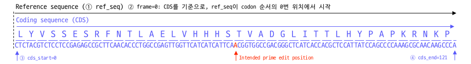

## Introduce Synonymous Mutation in pegRNA

### Additioal edit for efficient prime editing
---
Prime editing은 RT-PBS 외에도 다양한 요인들에 의해 효율이 결정된다. 대표적으로 잘 알려져있는 것은 mismatch repair (MMR) system에 의한 저해효과이다. MMR에 의한 prime editing efficiency 저해를 방지하기 위해, pegRNA에 추가적인 mutation을 도입하는 전략을 사용할 수 있다 ([Chen et al., 2021, Cell](https://doi.org/10.1016/j.cell.2021.09.018)). 

하지만, 추가적인 mutation을 도입하는 것은 MMR의 영향을 줄이는 효과와 함께 pegRNA의 activity를 떨어뜨리는 효과도 있을 수 있다. 또한, 만약 genome editing을 하려는 위치가 protein coding sequence (CDS) 영역이라면 단백질의 기능에 영향을 주지 않는 synonymous (silent) mutation을 도입할 필요가 있다. 위와 같은 내용들을 고려했을 때, 어떤 mutation을 추가로 도입하는 pegRNA를 선택할지 디자인하고 선택하는 것은 꽤나 번거로운 작업이다.


### `SynonymousPE` module in GenET
---
GenET의 `SynonymousPE`는 추가 mutation이 도입된 pegRNA를 손쉽게 디자인 할 수 있는 기능을 제공한다. 특히, CDS에 맞춰서 가능한 synonymous mutation을 찾아주므로, 생물학적 연구에 활용할 때 유용하게 사용될 수 있다. 

또한 `SynonymousPE`는 `DeepPrime`과 직접적으로 호환되기 때문에, `DeepPrime`에서 디자인한 pegRNA에 바로 synonymous mutation을 도입한 pegRNA를 만들 수 있다. 


```python
from genet.predict import DeepPrime
from genet.design import SynonymousPE

# DeepPrime pipeline
seq_wt   = 'CTTGCCTGTCTCTGTGGGCTGAAGGCTGTTCCCTGTTTCCTTCAGCTCTACGTCTCCTCCGAGAGCCGCTTCAACACCCTGGCCGAGTTGGTTCATCATCATTCAACGGTGGCCGACGGGC'
seq_ed   = 'CTTGCCTGTCTCTGTGGGCTGAAGGCTGTTCCCTGTTTCCTTCAGCTCTACGTCTCCTCCAAGAGCCGCTTCAACACCCTGGCCGAGTTGGTTCATCATCATTCAACGGTGGCCGACGGGC'

pegrna = DeepPrime('ABL1_ex4_pos21G_A', seq_wt, seq_ed, edit_type='sub', edit_len=1)

pe2max_output = pegrna.predict(pe_system='PE2max', cell_type='HEK293T')


# Select a pegRNA record that you want to add synonymous mutation 
dp_record = pe2max_output.iloc[9]

# Setup SynonymousPE input parameters 
synony_pegrna = SynonymousPE(dp_record, ref_seq=seq_wt,
                            frame=0, cds_start=45, cds_end=121)

# print selected RTT containing synonymous mutation
print(synony_pegrna.extension)
```

DeepPrime의 사용법에 대해서는 `genet.predict` module의 [documentation](/docs/en/1_Predict/predict_pe.md)에서 더 자세한 내용을 볼 수 있다. 위 예시에서는 디자인 된 수 많은 pegRNA 중에서 한 개의 pegRNA를 선택해서 synonymous mutation을 도입하였다. 각각의 pegRNA마다 RTT의 영역과 길이가 다르므로, 도입할 수 있는 additional mutation의 종류도 달라질 수 있다. 우선 DeepPrime score를 기준으로 적절한 pegRNA를 선정한 후, `SynonymousPE`를 추가로 활용하여 optimization을 해서 사용할 것을 권장한다. 

### SynonymousPE의 input parameters
---
`de_record`: pd.Series  
pegRNA의 정보를 담은 객체. DeepPrime을 이용해 디자인한 경우, 결과로 나온 `DataFrame`에서 특정 index를 불러오면 그대로 사용할 수 있다. 

`ref_seq`: str  
pegRNA의 표적이 되는 DNA 서열 정보. `SynonymousPE`는 이 서열 내에 CDS가 존재한다고 가정하고 정해진 규칙에 따라 synonymous mutation을 도입한다. 아래의 `frame`, `cds_start`, `cds_end`의 기준이 되는 유전 서열이다. 

`frame`: int  
Reference sequence (ref_seq) 서열의 frame을 나타내는 값이다. CDS의 codon frame에 의해 결정되며, 0, 1, 2 중에 하나로 표현된다. 예를 들어, CDS 서열이 codon (3bp)의 맨 앞부터 시작한다면, `frame`은 0으로 입력하면 된다. Frame이 정확하지 않으면 전혀 다른 amino acid 서열에 의한 synonymou mutation이 생성되므로, 꼼꼼하게 확인하고 입력해야 한다. 


`cds_start`: int  
`ref_seq`에서 CDS가 시작하는 위치를 의미한다.

`cds_end`: int  
`ref_seq`에서 CDS가 끝나는 위치를 의미한다.

`adj_rha`: bool  
Synonymous mutation이 RT template의 RHA에 생겼을 경우, RHA 길이가 너무 짧아지면 prime editing 효율이 급감할 수도 있다. 대안책으로, RT template의 길이를 인위적으로 늘려줄 수 있다. `adj_rha`는 RT template의 RHA가 짧아졌을 때, 그 길이만큼 RT template 길이를 늘려줄 것인지에 대한 옵션이다 (기본값: True). 만약 `adj_rha`=False인 경우, synonymous mutation이 생긴 위치에 관계없이, RT template의 길이는 원래 pegRNA의 그것과 동일하게 유지된다. 

### `SynonymousPE` input 예시
---
SynonymousPE의 frame과 CDS 위치 지정에 대한 내용은 처음 사용할 때 약간 복잡할 수 있다. 아래의 예시들을 참고해서 자신이 사용할 서열에 대해 정확히 지정해 사용하길 바란다. 

#### Example 1:
---


```python
from genet.design import SynonymousPE

# pegRNA record & ref_seq
dp_record = dp_record
ref_seq   = 'CTCTACGTCTCCTCCGAGAGCCGCTTCAACACCCTGGCCGAGTTGGTTCATCATCATTCAACGGTGGCCGACGGGCTCATCACCACGCTCCATTATCCAGCCCCAAAGCGCAACAAGCCCA'

# Setup SynonymousPE 
synony_pegrna = SynonymousPE(dp_record, ref_seq=ref_seq, frame=0, cds_start=0, cds_end=121)
```

#### Example 2:
---


```python
from genet.design import SynonymousPE

# pegRNA record & ref_seq
dp_record = dp_record
ref_seq   = 'CTACGTCTCCTCCGAGAGCCGCTTCAACACCCTGGCCGAGTTGGTTCATCATCATTCAACGGTGGCCGACGGGCTCATCACCACGCTCCATTATCCAGCCCCAAAGCGCAACAAGCCCACT'

# Setup SynonymousPE 
synony_pegrna = SynonymousPE(dp_record, ref_seq=ref_seq, frame=2, cds_start=0, cds_end=121)
```

#### Example 3:
---


```python
from genet.design import SynonymousPE

# pegRNA record & ref_seq
dp_record = dp_record
ref_seq   = 'TTGCCTGTCTCTGTGGGCTGAAGGCTGTTCCCTGTTTCCTTCAGCTCTACGTCTCCTCCGAGAGCCGCTTCAACACCCTGGCCGAGTTGGTTCATCATCATTCAACGGTGGCCGACGGGCT'

# Setup SynonymousPE 
synony_pegrna = SynonymousPE(dp_record, ref_seq=ref_seq, frame=1, cds_start=44, cds_end=121)
```


### `SynonymousPE`의 mutation 우선순위
---
pegRNA RT template에 1bp 돌연변이를 추가로 도입했을 때, synonymous mutation에 해당하는 것이 여러개가 존재할 수 있다. `SynonymousPE`는 이렇게 만들어질 수 있는 mutation들 각각에 우선순위 점수를 배정하고, 그 중 가장 우선순위가 높은 mutation을 추가로 도입한 RT template을 선정해서 `.extension`으로 제공한다. `SynonymousPE`의 우선순위를 산정하는 기준은 아래와 같다. 

- 1순위: PAM (GG)을 없애주는 synonymous mutation이 존재할 경우, 가장 우선순위를 높게 배정한다.
- 2순위: Left homology arm (LHA)에 도입할 경우, intended prime-edit position에 가까울 수록 우선순위를 높게 배정한다.
- 3순위: Right homology arm (RHA)에 도입할 경우, intended prime-edit position에 가까울 수록 우선순위를 높게 배정한다.


### `stack`: Synonymous mutation의 연속 도입
---
하나의 RT template에 여러개의 synonymous mutation들을 넣어주는 기능이다. 기본적으로 `SynonymousPE`는 RT template에 1개의 synonymous mutation만 도입한 것 중에서 가장 우선 순위가 높은 것을 선정해서 `.extension`으로 제공한다. 하지만 만약 2개 이상의 synonymous mutation을 한번에 도입하고 싶다면, `.stack` method를 사용할 수 있다. 

```python 
from genet.design import SynonymousPE

# SynonymousPE 객체를 생성
synony_pegrna = design.SynonymousPE(dp_record, ref_seq=seq_wt, frame=0)

# 최대 3개의 synonymous mutation이 도입된 RT template을 생성
three_syn = synony_pegrna.stack(num=3)
```

`.stack`은 가능한 synonymous mutation들을 배정된 우선순위 순으로 추가로 도입해준다. 각각의 synonymous mutation이 1개씩만 도입되었을 때는 amino acid 서열 변화가 없지만, 2개가 동시에 도입될 때에는 amino acid 서열 변화가 생기는 경우도 있다. 이러한 경우에는 다음 우선순위의 mutation으로 넘어간다.


### SynonymousPE에서 불러올 수 있는 객체들
---
아래는 주요 결과들을 확인할 수 있는 객체들이다. 

| Name          | Type         | Description                                                                                  |
| ------------- | ------------ | -------------------------------------------------------------------------------------------- |
| `.extension`  | str          | Selected RT-PBS sequence containing recommanded synonymous mutation.                         |
| `.synonymous` | pd.DataFrame | Table of available synonymous mutations and corresponding informations for given pegRNA.     |
| `.mutations`  | pd.DataFrame | Table of all available additional mutations and corresponding informations for given pegRNA. |
| `.rec`        | pd.Series    | Record of pegRNA from input.                                                                 |

다음과 같이 값을 확인할 수 있다. 

```python 
from genet.design import SynonymousPE

# SynonymousPE 객체를 생성
synony_pegrna = design.SynonymousPE(dp_record, ref_seq=seq_wt, frame=0)

# 도입 가능한 synonymous mutations 확인
synony_pegrna.synonymous
```

Results:

| Codon_WT                                | Codon_Mut                               | Codon_MutPos | Codon_RefStart | Codon_RefEnd | RTT_DNA_frame | RTT_DNA_Strand | AminoAcid_WT | AminoAcid_Mut | Silent_check | Mut_pos | Mut_refpos | PAM_Mut | Priority | Edit_class | RTT_DNA_Mut                            |
| --------------------------------------- | --------------------------------------- | ------------ | -------------- | ------------ | ------------- | -------------- | ------------ | ------------- | ------------ | ------- | ---------- | ------- | -------- | ---------- | -------------------------------------- |
| GCCGTGGAGGAGCCGCAGTCAGATCCTAGCGTCGAGCCC | GCCGTCGAGGAGCCGCAGTCAGATCCTAGCGTCGAGCCC | 5            | 58             | 97           | 1             | +              | VEEPQSDPSVEP | VEEPQSDPSVEP  | TRUE         | 5       | 62         | CG      | 1        | PAM_edit   | CCGTCGAGGAGCCGCAGTCAGATCCTAGCGTCGAGCCC |
| GCCGTGGAGGAGCCGCAGTCAGATCCTAGCGTCGAGCCC | GCCGTAGAGGAGCCGCAGTCAGATCCTAGCGTCGAGCCC | 5            | 58             | 97           | 1             | +              | VEEPQSDPSVEP | VEEPQSDPSVEP  | TRUE         | 5       | 62         | AG      | 2        | PAM_edit   | CCGTAGAGGAGCCGCAGTCAGATCCTAGCGTCGAGCCC |
| GCCGTGGAGGAGCCGCAGTCAGATCCTAGCGTCGAGCCC | GCCGTTGAGGAGCCGCAGTCAGATCCTAGCGTCGAGCCC | 5            | 58             | 97           | 1             | +              | VEEPQSDPSVEP | VEEPQSDPSVEP  | TRUE         | 5       | 62         | TG      | 2        | PAM_edit   | CCGTTGAGGAGCCGCAGTCAGATCCTAGCGTCGAGCCC |
| GCCGTGGAGGAGCCGCAGTCAGATCCTAGCGTCGAGCCC | GCCGTGGAAGAGCCGCAGTCAGATCCTAGCGTCGAGCCC | 8            | 58             | 97           | 1             | +              | VEEPQSDPSVEP | VEEPQSDPSVEP  | TRUE         | 8       | 65         | GG      | 15       | RHA_edit   | CCGTGGAAGAGCCGCAGTCAGATCCTAGCGTCGAGCCC |
| GCCGTGGAGGAGCCGCAGTCAGATCCTAGCGTCGAGCCC | GCCGTGGAGGAACCGCAGTCAGATCCTAGCGTCGAGCCC | 11           | 58             | 97           | 1             | +              | VEEPQSDPSVEP | VEEPQSDPSVEP  | TRUE         | 11      | 68         | GG      | 18       | RHA_edit   | CCGTGGAGGAACCGCAGTCAGATCCTAGCGTCGAGCCC |
| GCCGTGGAGGAGCCGCAGTCAGATCCTAGCGTCGAGCCC | GCCGTGGAGGAGCCCCAGTCAGATCCTAGCGTCGAGCCC | 14           | 58             | 97           | 1             | +              | VEEPQSDPSVEP | VEEPQSDPSVEP  | TRUE         | 14      | 71         | GG      | 20       | RHA_edit   | CCGTGGAGGAGCCCCAGTCAGATCCTAGCGTCGAGCCC |
| GCCGTGGAGGAGCCGCAGTCAGATCCTAGCGTCGAGCCC | GCCGTGGAGGAGCCACAGTCAGATCCTAGCGTCGAGCCC | 14           | 58             | 97           | 1             | +              | VEEPQSDPSVEP | VEEPQSDPSVEP  | TRUE         | 14      | 71         | GG      | 21       | RHA_edit   | CCGTGGAGGAGCCACAGTCAGATCCTAGCGTCGAGCCC |
| GCCGTGGAGGAGCCGCAGTCAGATCCTAGCGTCGAGCCC | GCCGTGGAGGAGCCTCAGTCAGATCCTAGCGTCGAGCCC | 14           | 58             | 97           | 1             | +              | VEEPQSDPSVEP | VEEPQSDPSVEP  | TRUE         | 14      | 71         | GG      | 21       | RHA_edit   | CCGTGGAGGAGCCTCAGTCAGATCCTAGCGTCGAGCCC |
| GCCGTGGAGGAGCCGCAGTCAGATCCTAGCGTCGAGCCC | GCCGTGGAGGAGCCGCAATCAGATCCTAGCGTCGAGCCC | 17           | 58             | 97           | 1             | +              | VEEPQSDPSVEP | VEEPQSDPSVEP  | TRUE         | 17      | 74         | GG      | 24       | RHA_edit   | CCGTGGAGGAGCCGCAATCAGATCCTAGCGTCGAGCCC |
| GCCGTGGAGGAGCCGCAGTCAGATCCTAGCGTCGAGCCC | GCCGTGGAGGAGCCGCAGTCTGATCCTAGCGTCGAGCCC | 20           | 58             | 97           | 1             | +              | VEEPQSDPSVEP | VEEPQSDPSVEP  | TRUE         | 20      | 77         | GG      | 26       | RHA_edit   | CCGTGGAGGAGCCGCAGTCTGATCCTAGCGTCGAGCCC |
| GCCGTGGAGGAGCCGCAGTCAGATCCTAGCGTCGAGCCC | GCCGTGGAGGAGCCGCAGTCCGATCCTAGCGTCGAGCCC | 20           | 58             | 97           | 1             | +              | VEEPQSDPSVEP | VEEPQSDPSVEP  | TRUE         | 20      | 77         | GG      | 27       | RHA_edit   | CCGTGGAGGAGCCGCAGTCCGATCCTAGCGTCGAGCCC |
| GCCGTGGAGGAGCCGCAGTCAGATCCTAGCGTCGAGCCC | GCCGTGGAGGAGCCGCAGTCGGATCCTAGCGTCGAGCCC | 20           | 58             | 97           | 1             | +              | VEEPQSDPSVEP | VEEPQSDPSVEP  | TRUE         | 20      | 77         | GG      | 27       | RHA_edit   | CCGTGGAGGAGCCGCAGTCGGATCCTAGCGTCGAGCCC |
| GCCGTGGAGGAGCCGCAGTCAGATCCTAGCGTCGAGCCC | GCCGTGGAGGAGCCGCAGTCAGACCCTAGCGTCGAGCCC | 23           | 58             | 97           | 1             | +              | VEEPQSDPSVEP | VEEPQSDPSVEP  | TRUE         | 23      | 80         | GG      | 30       | RHA_edit   | CCGTGGAGGAGCCGCAGTCAGACCCTAGCGTCGAGCCC |
| GCCGTGGAGGAGCCGCAGTCAGATCCTAGCGTCGAGCCC | GCCGTGGAGGAGCCGCAGTCAGATCCAAGCGTCGAGCCC | 26           | 58             | 97           | 1             | +              | VEEPQSDPSVEP | VEEPQSDPSVEP  | TRUE         | 26      | 83         | GG      | 32       | RHA_edit   | CCGTGGAGGAGCCGCAGTCAGATCCAAGCGTCGAGCCC |
| GCCGTGGAGGAGCCGCAGTCAGATCCTAGCGTCGAGCCC | GCCGTGGAGGAGCCGCAGTCAGATCCGAGCGTCGAGCCC | 26           | 58             | 97           | 1             | +              | VEEPQSDPSVEP | VEEPQSDPSVEP  | TRUE         | 26      | 83         | GG      | 33       | RHA_edit   | CCGTGGAGGAGCCGCAGTCAGATCCGAGCGTCGAGCCC |
| GCCGTGGAGGAGCCGCAGTCAGATCCTAGCGTCGAGCCC | GCCGTGGAGGAGCCGCAGTCAGATCCCAGCGTCGAGCCC | 26           | 58             | 97           | 1             | +              | VEEPQSDPSVEP | VEEPQSDPSVEP  | TRUE         | 26      | 83         | GG      | 33       | RHA_edit   | CCGTGGAGGAGCCGCAGTCAGATCCCAGCGTCGAGCCC |
| GCCGTGGAGGAGCCGCAGTCAGATCCTAGCGTCGAGCCC | GCCGTGGAGGAGCCGCAGTCAGATCCTAGTGTCGAGCCC | 29           | 58             | 97           | 1             | +              | VEEPQSDPSVEP | VEEPQSDPSVEP  | TRUE         | 29      | 86         | GG      | 36       | RHA_edit   | CCGTGGAGGAGCCGCAGTCAGATCCTAGTGTCGAGCCC |
| GCCGTGGAGGAGCCGCAGTCAGATCCTAGCGTCGAGCCC | GCCGTGGAGGAGCCGCAGTCAGATCCTAGCGTGGAGCCC | 32           | 58             | 97           | 1             | +              | VEEPQSDPSVEP | VEEPQSDPSVEP  | TRUE         | 32      | 89         | GG      | 38       | RHA_edit   | CCGTGGAGGAGCCGCAGTCAGATCCTAGCGTGGAGCCC |
| GCCGTGGAGGAGCCGCAGTCAGATCCTAGCGTCGAGCCC | GCCGTGGAGGAGCCGCAGTCAGATCCTAGCGTAGAGCCC | 32           | 58             | 97           | 1             | +              | VEEPQSDPSVEP | VEEPQSDPSVEP  | TRUE         | 32      | 89         | GG      | 39       | RHA_edit   | CCGTGGAGGAGCCGCAGTCAGATCCTAGCGTAGAGCCC |
| GCCGTGGAGGAGCCGCAGTCAGATCCTAGCGTCGAGCCC | GCCGTGGAGGAGCCGCAGTCAGATCCTAGCGTTGAGCCC | 32           | 58             | 97           | 1             | +              | VEEPQSDPSVEP | VEEPQSDPSVEP  | TRUE         | 32      | 89         | GG      | 39       | RHA_edit   | CCGTGGAGGAGCCGCAGTCAGATCCTAGCGTTGAGCCC |
| GCCGTGGAGGAGCCGCAGTCAGATCCTAGCGTCGAGCCC | GCCGTGGAGGAGCCGCAGTCAGATCCTAGCGTCGAACCC | 35           | 58             | 97           | 1             | +              | VEEPQSDPSVEP | VEEPQSDPSVEP  | TRUE         | 35      | 92         | GG      | 42       | RHA_edit   | CCGTGGAGGAGCCGCAGTCAGATCCTAGCGTCGAACCC |
| GCCGTGGAGGAGCCGCAGTCAGATCCTAGCGTCGAGCCC | GCCGTGGAGGAGCCGCAGTCAGATCCTAGCGTCGAGCCG | 38           | 58             | 97           | 1             | +              | VEEPQSDPSVEP | VEEPQSDPSVEP  | TRUE         | 38      | 95         | GG      | 44       | RHA_edit   | CCGTGGAGGAGCCGCAGTCAGATCCTAGCGTCGAGCCG |
| GCCGTGGAGGAGCCGCAGTCAGATCCTAGCGTCGAGCCC | GCCGTGGAGGAGCCGCAGTCAGATCCTAGCGTCGAGCCA | 38           | 58             | 97           | 1             | +              | VEEPQSDPSVEP | VEEPQSDPSVEP  | TRUE         | 38      | 95         | GG      | 45       | RHA_edit   | CCGTGGAGGAGCCGCAGTCAGATCCTAGCGTCGAGCCA |
| GCCGTGGAGGAGCCGCAGTCAGATCCTAGCGTCGAGCCC | GCCGTGGAGGAGCCGCAGTCAGATCCTAGCGTCGAGCCT | 38           | 58             | 97           | 1             | +              | VEEPQSDPSVEP | VEEPQSDPSVEP  | TRUE         | 38      | 95         | GG      | 45       | RHA_edit   | CCGTGGAGGAGCCGCAGTCAGATCCTAGCGTCGAGCCT |


아래는 코드 내에서 디자인을 위해 사용된 parameter들과 기타 세부 정보들을 담은 객체들이다.

| Name         | Type | Description                                               |
| ------------ | ---- | --------------------------------------------------------- |
| `.sID`       | str  | Sample ID from pegRNA record.                             |
| `.rtpbs_dna` | str  | Reverse complementary DNA sequence of RT-PBS.             |
| `.pbs_dna`   | str  | Reverse complementary DNA sequence of PBS.                |
| `.rtt_dna`   | str  | Reverse complementary DNA sequence of RT template         |
| `.rtt_len`   | int  | Length of RT template                                     |
| `.wt_seq`    | str  | WT target sequence (74nt)                                 |
| `.ed_seq`    | str  | Prime-edited target sequence (74nt)                       |
| `.edit_pos`  | int  | Position of intended prime editing. Start from nick site. |
| `.ref_seq`   | str  | Reference target sequence from input.                     |
| `.frame`     | int  | Frame of coding sequence (CDS) from input.                |
| `.cds_start` | int  | Start position of CDS                                     |
| `.cds_end`   | int  | End position of CDS                                       |
| `.strand`    | str  | Strand of pegRNA. It should '+' or '-'.                   |
| `.rtt_frame` | int  | Frame of RT template.                                     |
| `.codon_le`  | int  | Length of left end (LE) of codon sequence.                |
| `.codon_re`  | int  | Length of right end (RE) of codon sequence.               |
| `.codon_RTT` | str  | Codon sequence with RT template.                          |

다음과 같이 값을 확인할 수 있다. 

```python 
from genet.design import SynonymousPE

# SynonymousPE 객체를 생성
synony_pegrna = design.SynonymousPE(dp_record, ref_seq=seq_wt, frame=0)

# 도입 가능한 synonymous mutations 확인
synony_pegrna.ref_seq
```