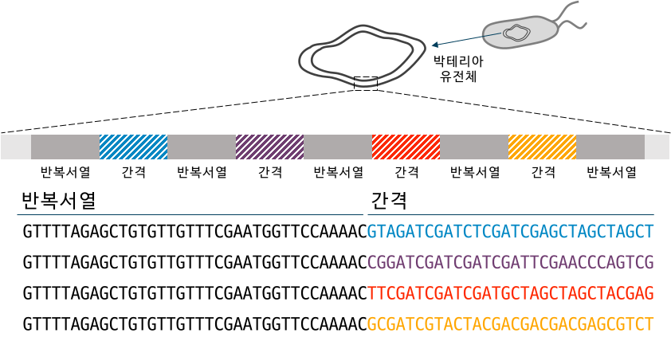

## 유전체와 유전정보
유전체 (Genome)는 한 개체의 모든 유전정보의 집합을 말한다. 대부분의 유전체는 DNA로 존재하지만, 일부 바이러스와 같은 개체는 RNA로 유전체가 존재하기도 한다. 인간과 같은 진핵생물의 유전체는 대부분 핵 안에 있는 DNA에 존재하지만, 미토콘드리아와 같은 핵 바깥쪽 영역에도 소량의 유전체가 존재한다. 이러한 유전체는 염기서열 (A, T, G, C)의 긴 조합으로 활동에 필요한 기능들을 발현하는 암호들을 지니고 있다. 인간의 경우, 약 30억 쌍의 염기서열 정보가 유전체 안에 담겨있다.

유전체 내에서 특정 영역들은 생명활동을 하는데 필요한 단백질 발현의 정보를 담고 있으며, 우리는 이를 유전자 (gene)라고 부른다. 종종 유전자와 유전체를 혼용하여 부르는 경우가 있지만, 유전체는 유전자를 포함한 전체 유전정보를 포괄하는 상위개념이다. 

정확히 단백질 정보를 담고 있는 유전자는 정상적인 생명활동을 유지할 수 있도록 한다. 만약 유전자에 돌연변이가 생긴다면 생명활동에 필요한 정상 단백질이 제대로 생성되지 않아서 질병이 생기거나 생명 유지가 어려울 수 있다. 이렇게 유전정보가 망가져서 생기는 질환을 '유전질환'이라고 부른다. 

## 유전자 교정
Genome editing을 국내 학계에서 지칭하는 '유전자 교정'은 사실 '유전체 교정'이 더 명확한 표현이다. 하지만 한국에서는 대중에게 쉽게 이해시킬 수 있는 개념인 유전자를 명칭에 사용하여 통용하고 있다. 

유전자 교정은 원하는 유전자 서열 위치에 특정 유전정보를 편집할 수 있는 기술이다. 초창기에 징크핑거 유전자 가위 (ZFN)와 탈렌 (TALEN)을 이용한 유전자 교정 연구가 활발하게 진행되면서, 현재는 CRISPR (Clustered Regularly Interspaced Short Palindromic Repeats)를 이용한 기술이 주로 연구되고 있다. 

## CRISPR의 작동 원리

CRISPR는 bacteria의 유전자를 전문적으로 연구하던 과학자들이 발견한 아주 특이한 구조의 서열이다. 특정 서열이 반복 (repeat) 되고, 사이사이마다 특정 간격의 서열 (spacer)이 반복되는 구조이다. 지금까지 기능을 알 수 없던 유전자들은 많았으나, 이렇게 규칙적으로 반복되는 서열이 명확하게 존재하는 경우는 흔치 않았다. 심지어 특정 박테리아 종에서만 발견되는 것이 아니라, 수 많은 종에서 유사한 구조들이 발견된다는 보고들이 발표되었다. 훗날 이는 Cas9이라는 유전자 가위 단백질이 작동할 위치를 지정해주는 guide RNA (gRNA)의 형태라는 것이 밝혀졌다.

## 다양한 종류의 CRISPR system
초기의 유전자 교정 기술들은 대부분 이중 가닥 절단 (double strand break; DSB)를 일으키고, 해당 위치에 원하는 유전자 교정을 유도하는 방식이었다. 하지만 DSB를 일으킬 경우, 원하지 않는 유전자의 손상이 일어날 위험성이 높기 때문에 안전성에 대한 큰 한계가 있었다. 

이후, DSB를 일으키지 않고도 유전자 교정을 할 수 있는 염기 편집기 (base editor; BE)가 개발되면서, 임상적으로 중요한 유전자 돌연변이 중 대부분의 단일 염기 변이 (SNVs)를 훨씬 안전하게 교정할 수 있는 기술을 얻게 되었다. 

최근에는 DSB를 일으키지 않고도 모든 형태의 유전자 교정 (치환, 삽입, 삭제)을 할 수 있는 기술은 프라임 에디팅 (prime editing; PE)가 개발되면서, 유전자 교정의 범위를 훨씬 확장할 수 있게 되었다. 

